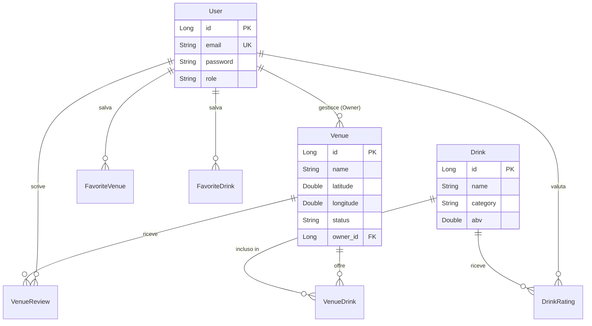

# 🍺 LocalBrew — Web App Full-Stack per Pub e Birrifici


LocalBrew è una web application full-stack per la scoperta e la gestione di locali, pub e birrifici artigianali. L'applicazione permette agli utenti di esplorare i locali su una mappa interattiva, consultare drink e recensioni, salvare preferiti e contribuire con valutazioni.

Il progetto integra un backend REST con autenticazione JWT e un frontend statico modulare, con una UX centrata sulla ricerca geografica e sulla consultazione rapida delle informazioni.

---

## Autori & Contributors

* [Eva](https://github.com/evamicadeva)
* [Stefano](https://github.com/ste-riiba)
* [Gabriel](https://github.com/GabriR02)
* [Walid](https://github.com/WalidDalal)
* [Dario](https://github.com/Thario02)

---

## Funzionalità

### Esplorazione pubblica
* Mappa interattiva dei locali attivi con Leaflet e Marker clustering.
* Ricerca di locali per nome, città e tipologia.
* Filtro dei locali in base alle categorie di birra disponibili.
* Scheda dettaglio del locale con informazioni, drink associati e recensioni.
* Visualizzazione delle valutazioni medie di locali e drink.
* Tema chiaro/scuro lato frontend.

### Utenti autenticati
* Registrazione e login tramite JWT.
* Gestione del profilo personale e salvataggio preferiti (locali e drink).
* Creazione, modifica e cancellazione delle proprie recensioni e valutazioni sui drink.

### Proprietari
* Creazione, aggiornamento e cancellazione dei propri locali.
* Upload immagini per locali e drink.
* Creazione e gestione del catalogo drink con associazione ai locali gestiti.
* Dashboard dedicata per la consultazione dei locali in gestione.

### Amministratori
* Consultazione completa dei locali registrati e gestione ruoli utente.
* Moderazione dei locali tramite stati `PENDING`, `ACTIVE` e `SUSPENDED`.
* Approvazione, sospensione e moderazione delle recensioni.

---

## Stack Tecnologico

### Backend
* **Language:** Java 25
* **Framework:** Spring Boot 4.0.6 (Spring Web MVC, Spring Data JPA, Spring Security)
* **Security:** JWT con `jjwt`
* **Utilities:** Bean Validation, Lombok
* **Database:** PostgreSQL 17
* **Containerization:** Docker & Docker Compose
* **Build Tool:** Maven

### Frontend & Integrazioni
* HTML5, CSS3, JavaScript ES Modules
* Leaflet & Leaflet MarkerCluster
* Font Awesome
* Nominatim/OpenStreetMap per il geocoding degli indirizzi

---

## Modello Dati (ER Diagram)


## Sicurezza e Ruoli

L'autenticazione è stateless e basata su token JWT. Le password vengono salvate con hashing BCrypt.

| Prefisso | Accesso | Descrizione |
| --- | --- | --- |
| `/api/v1/auth/**` | Pubblico | Registrazione e login |
| `/api/v1/public/**` | Pubblico | Consultazione contenuti |
| `/api/v1/user/**` | Utenti autenticati | Profilo, preferiti, recensioni |
| `/api/v1/owner/**` | Proprietari e amministratori | Gestione locali, drink e upload |
| `/api/v1/admin/**` | Amministratori | Moderazione e ruoli |

---

## API Principali

| Area | Endpoint | Descrizione |
| --- | --- | --- |
| **Auth** | `POST /api/v1/auth/register` | Registrazione utente |
| **Auth** | `POST /api/v1/auth/login` | Login e generazione JWT |
| **Public** | `GET /api/v1/public/venues/active` | Elenco dei locali attivi |
| **Public** | `GET /api/v1/public/venues/{id}` | Dettaglio di un locale |
| **Public** | `GET /api/v1/public/venues/search/city` | Ricerca locali per città |
| **Public** | `GET /api/v1/public/drinks` | Ricerca drink per nome o categoria |
| **User** | `GET /api/v1/user/me` | Profilo dell'utente corrente |
| **User** | `POST /api/v1/user/favorite-venues` | Aggiunta locale ai preferiti |
| **Owner** | `POST /api/v1/owner/venues` | Creazione locale |
| **Owner** | `POST /api/v1/owner/images/venue` | Upload immagine locale |
| **Admin** | `PATCH /api/v1/admin/venues/{id}/activate` | Approvazione locale |
| **Admin** | `PATCH /api/v1/admin/users/{id}/role` | Aggiornamento ruolo utente |

---

## Avvio Rapido con Docker

### Prerequisiti

* [Docker Desktop](https://www.docker.com/products/docker-desktop/) installato e avviato.

### Passaggi

1. **Clona il repository:**
```bash
git clone https://github.com/ste-riiba/localbrew.git
cd LocalBrew

```


2. **Compila il pacchetto JAR:**
```bash
./mvnw clean package -DskipTests

```


*(Su Windows: `.\mvnw.cmd clean package -DskipTests`)*
3. **Avvia i servizi con Docker Compose:**
```bash
docker compose up --build -d

```


4. L'applicazione web e le API REST saranno accessibili all'indirizzo `http://localhost:8080`.
Il database PostgreSQL rimarrà isolato o accessibile sulla porta `5432`.

```

```
